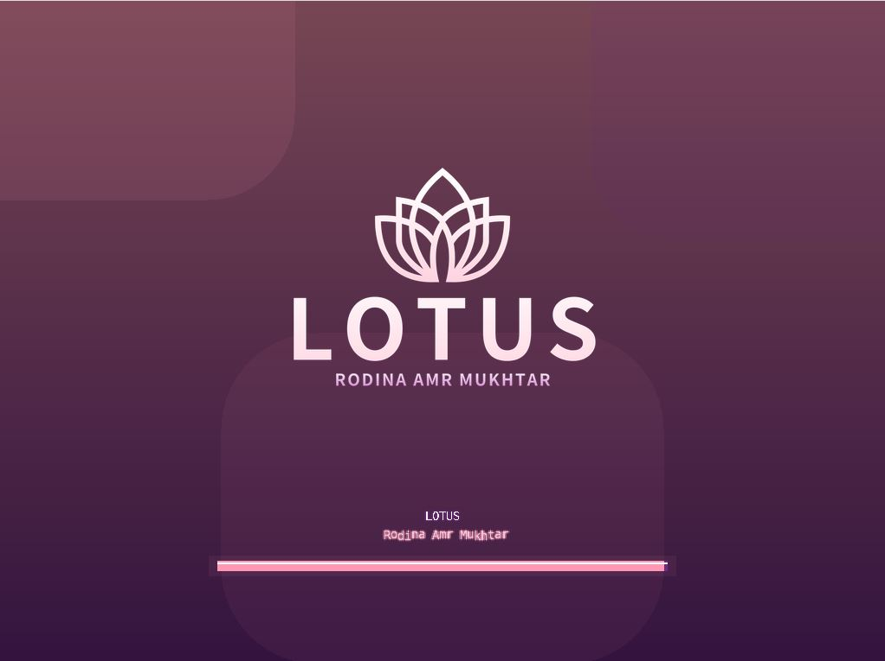
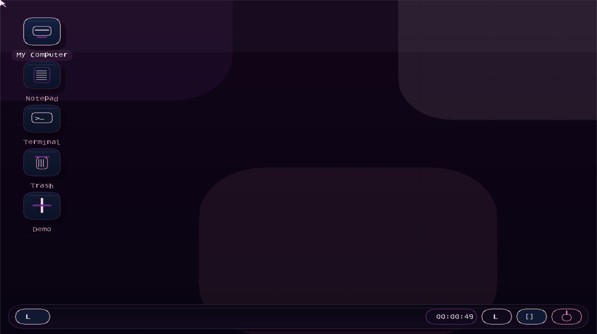
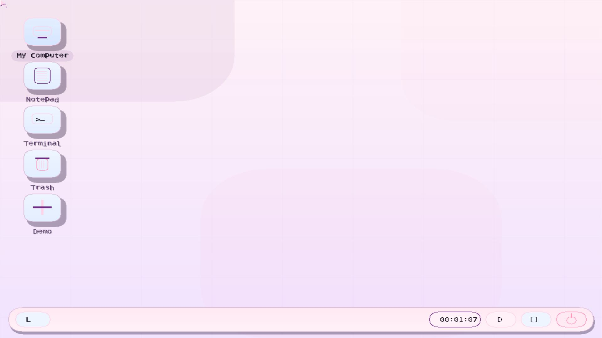
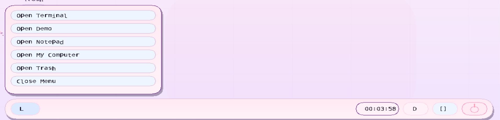
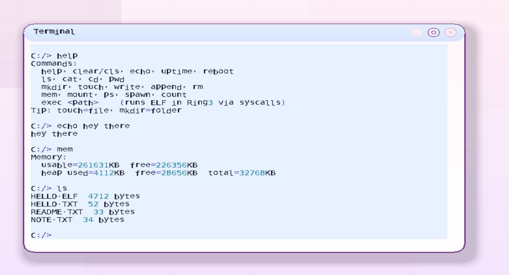
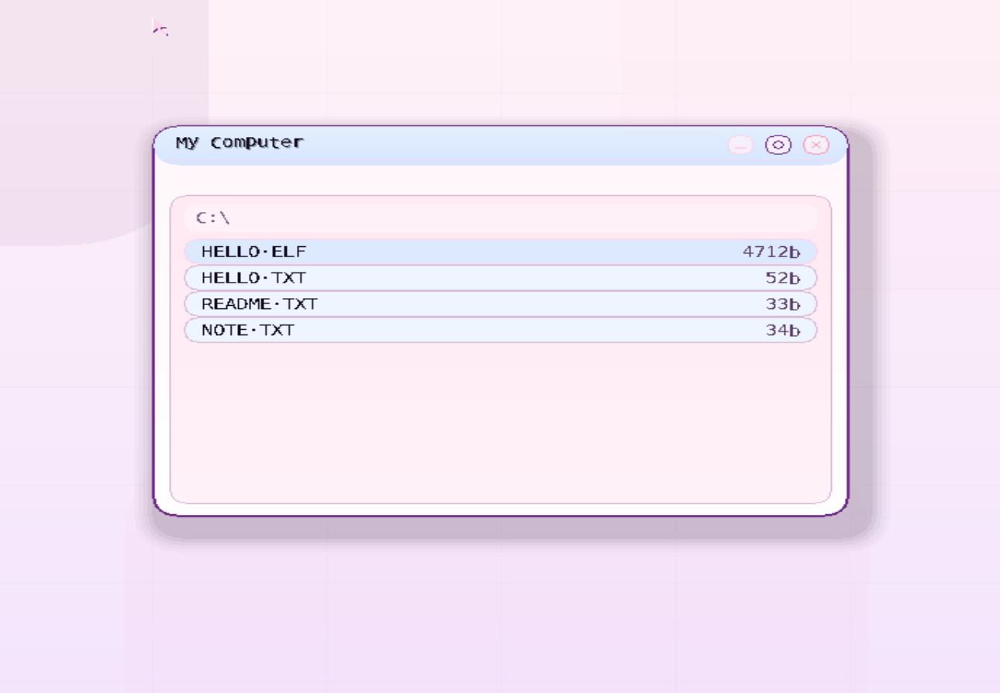
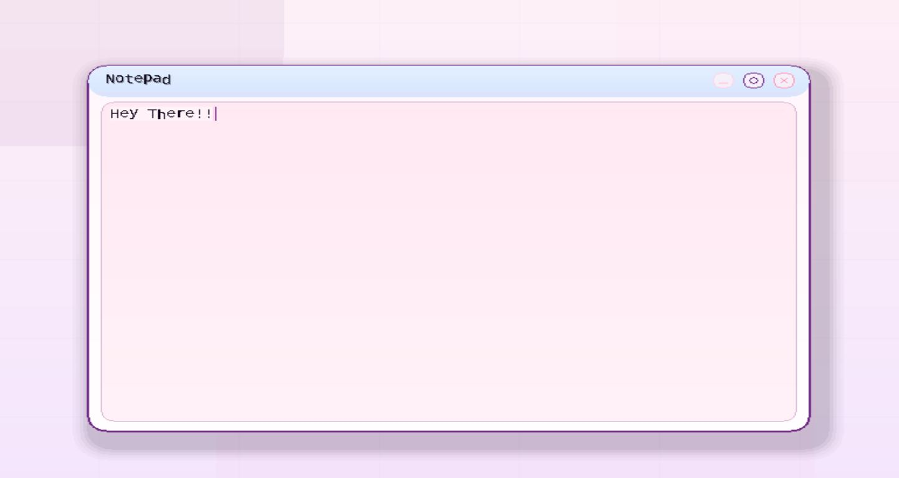

# LotusOS x86 İşletim Sistemi


## Proje Özeti

**LotusOS**, C, C++ ve Assembly kullanılarak geliştirilen eğitim amaçlı bir **x86 tabanlı mini işletim sistemi** projesidir. Proje; çekirdek başlatma süreci, kesme yönetimi, fiziksel bellek yönetimi, sayfalama, FAT32 dosya sistemi, terminal komutları, basit görev yönetimi, grafik arayüz, pencere yöneticisi ve kullanıcı modunda çalışan örnek ELF uygulaması gibi işletim sistemi geliştirme konularını tek bir yapı içinde uygulamalı olarak göstermektedir.

Bu proje, klasik masaüstü uygulamalarından farklı olarak doğrudan düşük seviyeli sistem programlama konularına odaklanır. Amaç, işletim sistemlerinin donanım ile nasıl iletişim kurduğunu, çekirdeğin temel servisleri nasıl yönettiğini ve kullanıcıya grafiksel/komut satırı tabanlı bir arayüzün nasıl sunulabileceğini pratik bir örnek üzerinden göstermektir.

## Amaç

Projenin temel amacı, bilgisayar mühendisliği alanında önemli bir yere sahip olan **işletim sistemi tasarımı**, **çekirdek geliştirme**, **dosya sistemi**, **kesmeler**, **bellek yönetimi** ve **grafik arayüz** gibi konuları uygulamalı olarak öğrenmektir.

LotusOS; akademik portföy, GitHub profili ve staj başvuruları için teknik seviyesi yüksek bir proje olarak değerlendirilebilir. Çünkü proje yalnızca hazır framework kullanımı değil, düşük seviyeli programlama, mimari tasarım ve sistem bileşenlerinin birlikte çalışması gibi konuları da göstermektedir.

## Temel Özellikler

- **x86 32-bit çekirdek:** Freestanding C/C++ ve Assembly ile hazırlanmış kernel yapısı.
- **Limine + Multiboot2 desteği:** Çekirdeğin modern bir bootloader üzerinden başlatılması.
- **GDT, IDT ve ISR yapıları:** Kesme ve işlemci yapılandırmalarının temel seviyede uygulanması.
- **PIC, timer, klavye ve mouse desteği:** Donanım olaylarının çekirdek tarafından yakalanması.
- **Fiziksel bellek yönetimi:** PMM, heap ve paging bileşenleri ile bellek yönetimi altyapısı.
- **FAT32 dosya sistemi:** Disk imajı üzerinden dosya ve klasör işlemleri.
- **VFS yaklaşımı:** Dosya sistemi erişimi için daha düzenli bir soyutlama katmanı.
- **Terminal uygulaması:** Komut satırı üzerinden dosya, bellek, süreç ve sistem işlemleri.
- **ELF çalıştırma desteği:** Kullanıcı modunda çalışan örnek `HELLO.ELF` uygulaması.
- **Basit görev yönetimi:** Arka plan görevleri ve süreç listesi için temel task yapısı.
- **Grafik arayüz:** Masaüstü, dock, başlat menüsü, pencere sistemi ve tema desteği.
- **Not Defteri ve Dosya Yöneticisi:** Grafik arayüz üzerinde basit kullanıcı uygulamaları.
- **Koyu/açık tema:** Arayüzün farklı görsel tema seçenekleriyle çalışması.

## Kullanılan Teknolojiler

| Katman / Amaç | Teknoloji |
|---|---|
| Çekirdek Geliştirme | C |
| Grafik/Pencere Yönetimi | C++ |
| Düşük Seviye Başlatma ve Kesme Kodları | Assembly |
| Mimari | x86 32-bit |
| Boot Süreci | Limine, Multiboot2 |
| Dosya Sistemi | FAT32 |
| Uygulama Formatı | ELF |
| Derleme Sistemi | Makefile |
| Emülasyon | QEMU |
| Araçlar | GCC, G++, NASM, LD, xorriso, mtools |

## Proje Mimarisi

Proje, işletim sistemi bileşenlerini ayrı klasörler altında toplamaktadır. Bu yapı, çekirdek kodunun, boot dosyalarının, kullanıcı uygulamalarının ve disk içeriklerinin daha düzenli yönetilmesini sağlar.

```text
LotusOS/
├── apps/
│   ├── hello.c
│   └── hello.ld
│
├── boot/
│   ├── limine.conf
│   ├── stage1.asm
│   ├── stage2.asm
│   └── README_LIMINE.md
│
├── files/
│   ├── HELLO.TXT
│   └── README.TXT
│
├── kernel/
│   ├── kernel.c
│   ├── gdt.c / idt.c / isr.c
│   ├── pmm.c / paging.c / kheap.c
│   ├── fat32.c / vfs.c / disk.c
│   ├── keyboard.c / mouse.c / timer.c
│   ├── shell.c / terminal.c
│   ├── task.c / syscall.c / elf.c
│   ├── gfx.cpp / wm.cpp / ui.cpp
│   └── splash.c / logo.c
│
└── Makefile
```

## İşletim Sistemi Akışı

```text
Bootloader
    ↓
Multiboot2 ile kernel yükleme
    ↓
GDT / IDT / ISR / PIC yapılandırması
    ↓
Bellek yönetimi ve paging hazırlığı
    ↓
Disk ve FAT32 dosya sistemi başlatma
    ↓
Klavye, mouse, timer ve olay sistemi
    ↓
Terminal ve grafik arayüz başlatma
    ↓
Masaüstü, pencere yöneticisi ve uygulamalar
```

## Terminal Komutları

LotusOS içinde yer alan terminal, dosya sistemi ve temel sistem işlemleri için çeşitli komutlar destekler.

| Komut | Açıklama |
|---|---|
| `help` | Kullanılabilir komutları listeler. |
| `clear` / `cls` | Terminal ekranını temizler. |
| `echo` | Verilen metni ekrana yazdırır. |
| `uptime` | Sistemin çalışma süresini gösterir. |
| `mem` | Bellek kullanım bilgisini gösterir. |
| `mount` | Bağlı dosya sistemlerini listeler. |
| `ls` | Dosya ve klasörleri listeler. |
| `cat` | Dosya içeriğini görüntüler. |
| `cd` | Dizin değiştirir. |
| `pwd` | Mevcut dizini gösterir. |
| `mkdir` | Yeni klasör oluşturur. |
| `touch` | Yeni dosya oluşturur. |
| `write` | Dosyaya metin yazar. |
| `append` | Dosyanın sonuna metin ekler. |
| `rm` | Dosya siler. |
| `ps` | Çalışan görevleri listeler. |
| `spawn` | Örnek arka plan görevi başlatır. |
| `count` | Arka plan sayaç değerini gösterir. |
| `exec` | ELF formatındaki kullanıcı uygulamasını çalıştırır. |
| `reboot` | Sistemi yeniden başlatır. |

## Ekran Görüntüleri

Aşağıdaki ekran görüntüleri, LotusOS’un kurulum yapmadan incelenebilmesi için temel arayüz ve sistem özelliklerini göstermektedir.

### 1. Açılış Ekranı



Bu ekran, işletim sistemi başlatılırken gösterilen açılış/splash ekranıdır. Kernel başlatma süreci tamamlandıktan sonra kullanıcıya görsel bir karşılama sunulur. Bu bölüm, projenin yalnızca terminal tabanlı olmadığını ve grafik arayüz tarafında da çalışma yapıldığını gösterir.

### 2. Karanlık Tema Masaüstü



LotusOS’un koyu tema ile çalışan masaüstü görünümüdür. Ekranda masaüstü ikonları, dock, pencere yapısı ve grafiksel kullanıcı arayüzü bileşenleri görülmektedir. Bu ekran, pencere yöneticisi, tema sistemi ve kullanıcı etkileşimlerinin bir arada çalıştığını göstermesi açısından önemlidir.

### 3. Açık Tema Masaüstü



Açık tema desteğini gösteren masaüstü ekranıdır. Tema değişimi sayesinde arayüzün farklı renk düzenlerinde çalışabildiği görülmektedir. Bu özellik, grafik arayüzün sabit renklerden oluşmadığını ve görsel yapılandırmanın dinamik olarak değiştirilebildiğini gösterir.

### 4. Başlat Menüsü



Başlat menüsü, sistemde bulunan uygulamalara hızlı erişim sağlar. Terminal, Demo, Notepad, My Computer ve Trash gibi bileşenler bu menü üzerinden açılabilir. Bu yapı, masaüstü ortamının kullanıcı dostu bir uygulama başlatma mekanizmasına sahip olduğunu gösterir.

### 5. Terminal Uygulaması



Terminal uygulaması, LotusOS içinde komut satırı tabanlı işlemlerin yapılmasını sağlar. Dosya listeleme, dosya okuma, dizin değiştirme, bellek bilgisi görüntüleme, süreç kontrolü ve ELF çalıştırma gibi işlemler terminal üzerinden test edilebilir. Bu ekran, çekirdek servislerinin kullanıcıya komut satırı ile sunulduğunu gösterir.

### 6. Dosya Yöneticisi



My Computer ekranı, FAT32 dosya sistemi üzerinde bulunan dosya ve klasörlerin grafik arayüzde listelenmesini sağlar. Bu bölüm, disk imajındaki dosyaların yalnızca terminalden değil, pencere tabanlı bir arayüz üzerinden de görüntülenebildiğini gösterir.

### 7. Not Defteri



Notpad uygulaması, grafik arayüz içinde metin düzenleme işlevini temsil eder. Kullanıcı girişinin pencere sistemiyle birlikte işlenmesi, caret yönetimi, metin yazma ve basit düzenleme işlemleri bu ekran üzerinden gösterilir. Bu özellik, LotusOS’un uygulama benzeri arayüz bileşenleri geliştirebildiğini ortaya koyar.

## Kurulum ve Çalıştırma

Bu proje düşük seviyeli sistem programlama içerdiği için Linux veya WSL ortamında çalıştırılması önerilir.

### 1. Gerekli araçları yükleyin

Debian/Ubuntu tabanlı sistemlerde:

```bash
sudo apt update
sudo apt install build-essential gcc-multilib g++-multilib nasm make xorriso mtools qemu-system-x86 git
```

### 2. Depoyu klonlayın

```bash
git clone https://github.com/RodinaAmrMukhtar/lotusos-x86-isletim-sistemi.git
cd lotusos-x86-isletim-sistemi
```

### 3. Projeyi derleyip çalıştırın

```bash
make run
```

Bu komut kernel dosyasını derler, ISO/disk imajını hazırlar ve sistemi QEMU üzerinde çalıştırır.

### 4. Sadece temizleme işlemi yapmak için

```bash
make clean
```

Limine yerel olarak indirildiyse onu da temizlemek için:

```bash
make clean-limine
```

## Akademik Kazanımlar

Bu proje aşağıdaki teknik konuları uygulamalı şekilde göstermektedir:

- x86 mimarisinde işletim sistemi geliştirme
- Freestanding C/C++ ile kernel yazımı
- Assembly ile düşük seviye giriş noktaları ve kesme yapıları
- Bootloader ve Multiboot2 çalışma mantığı
- GDT, IDT, ISR ve PIC yapılandırması
- Timer, klavye ve mouse olaylarının işlenmesi
- Fiziksel bellek yönetimi, heap ve paging mantığı
- FAT32 dosya sistemi okuma/yazma işlemleri
- Basit VFS soyutlaması
- Terminal ve shell komutları
- ELF yükleme ve kullanıcı modu uygulama çalıştırma
- Grafik arayüz, pencere yönetimi ve tema sistemi
- QEMU üzerinde işletim sistemi test etme

## Lisans

Bu proje akademik amaçlı olarak geliştirilmiştir. Kaynak gösterilerek incelenmesi ve geliştirilmesi önerilir.
